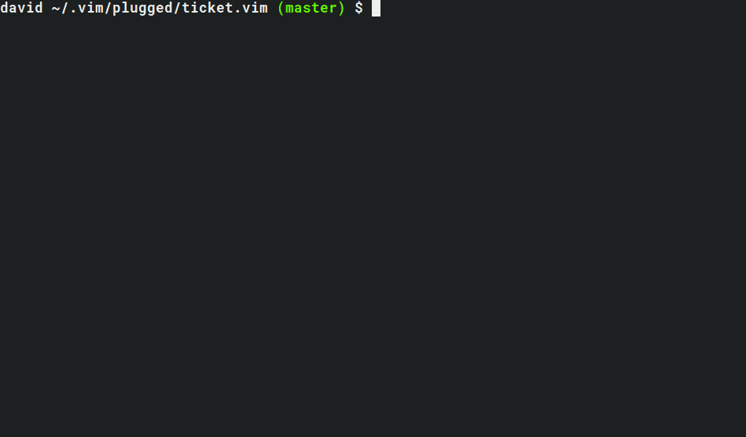

# ticket.vim

Creates and manges git branch specific session files.



## Function

This allows one to open and save session files associated with specific git branches easily. This is particularly useful if you need to switch branch, but want to preserve your vim state in the branch you are currently within.

When in the `branch1` you can execute `:SaveSession`, switch to `branch2` do what you need to do here then switch back to `branch1` and execute `:OpenSession`. Your vim instance will look exactly the same as it was prior to switching to `branch2`.

In this way, each branch can have its very own session that can be easily opened (`:OpenSession`) and saved/overwritten (`:SaveSession`).

Let's say every development ticket you get results in a new branch. Having a session & note file ready for when you have to revisit the ticket at a later date, due to another higher priority ticket requiring attention or lengthy code review process, is very useful for regaining your train of thought.

One can also have these session files automatically open and save.

Branch specific note files can be created & managed using `:OpenNote` & `:SaveNote`. This is useful when fixing a bug in a certain branch and you wish to document your findings while troubleshooting.

## Key Bindings

Commands:

- `:SaveSession` -- To create a branch session 

- `:OpenSession` -- Open the session

- `:SaveNote` -- Save notes about the branch

- `:OpenNote` -- Open branch note

- `:GrepNotes *` -- Search all notes for given arg

- `:GrepTicketNotesFzf` -- FZF grep notes (requires [FZF](https://github.com/junegunn/fzf.vim)

Normal Mode:

- `<Leader>ng` -- FZF grep notes (requires [FZF](https://github.com/junegunn/fzf.vim)
- `<Leader>ns` -- Save notes about branch
- `<Leader>no` -- Open branch note

## Settings

To automatically open and save session files when opening/closing vim set the following in your `.vimrc`:

```vim
let g:auto_ticket = 1
```

Black list some branches from being used with the auto feature:

```vim
let g:auto_ticket = 1
let g:ticket_black_list = ['master', 'other-branch']
```

## Installation

For vim-plug

```vim
Plug 'superDross/ticket.vim'
```

## File Storage

The session files are stored as below; git repository directory name with all branch specific session and note files within it.

```
~/.tickets/
│
└── <repository-name>/
   ├── <branch-name>.md
   └── <branch-name>.vim
```

## Caveats

The organisation and storage of the session files depends upon the repo & git branch pairing name being unique.

Only works within \*NIX based systems.

## TODO

- Create a blacklist for auto open/save settings e.g. disallow auto session open/saving of the `master` branch.
- Increase testing coverage.
- Allow user to override command names.
